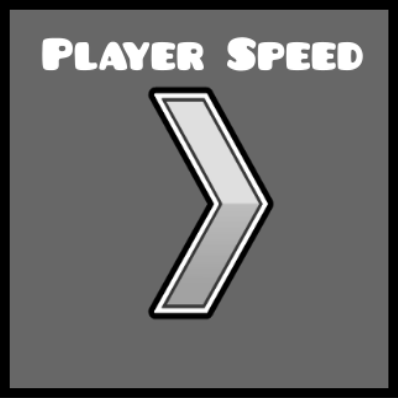

# Player Speed Trigger
This mod adds a player speed trigger.


Available in the level editor, in the trigger tab.

Important!
Only players with the mod can use the trigger.

This means that if other people try to play your level without the mod, the Player Speed Trigger will be not working and will not make the player speed change

## Build instructions
For more info, see [our docs](https://docs.geode-sdk.org/getting-started/create-mod#build)
```sh
# Assuming you have the Geode CLI set up already
geode build
```

# Resources
* [Geode SDK Documentation](https://docs.geode-sdk.org/)
* [Geode SDK Source Code](https://github.com/geode-sdk/geode/)
* [Geode CLI](https://github.com/geode-sdk/cli)
* [Bindings](https://github.com/geode-sdk/bindings/)
* [Dev Tools](https://github.com/geode-sdk/DevTools)
